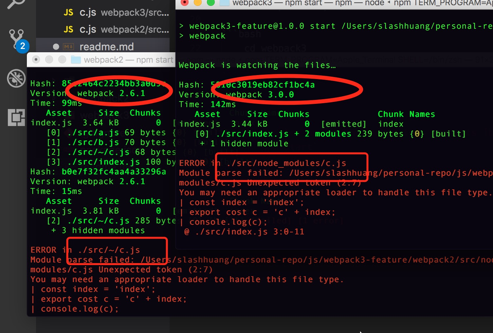
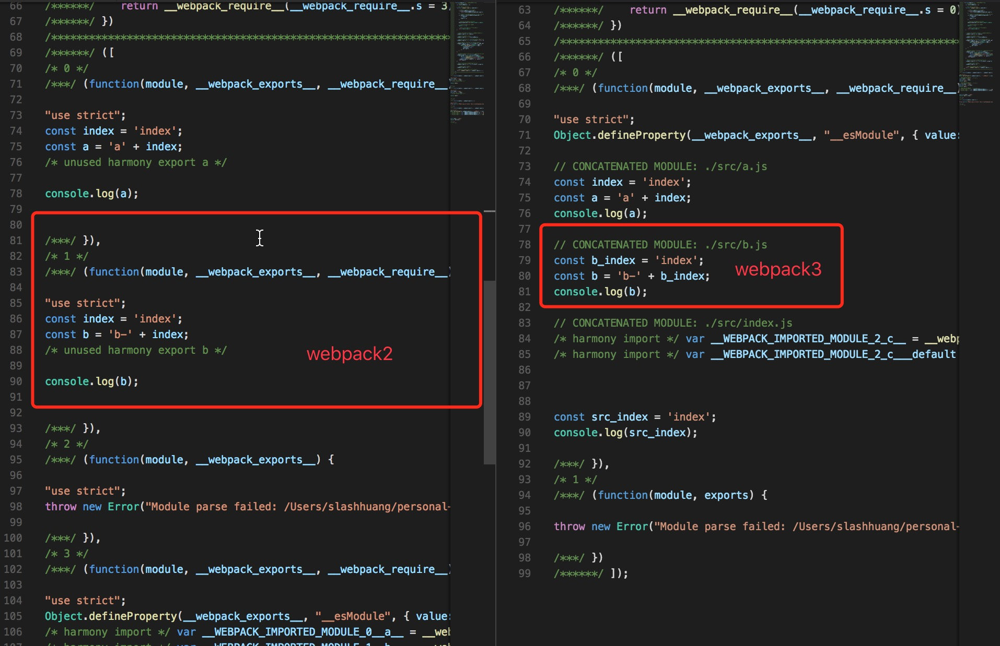

## webpack3-feature

A repository for you to understand diff feature for webpack3 versus webpack2

## How to run 

```bash
    # install dependencies
    npm run i
```

## run webpack2 repo

```bash
    cd webpack2
    npm start
```

## run webpack3 repo

```bash
    cd webpack3
    npm start
```

## feature [breaking change]

- 1. node_modules no longer mangle to ~ in stats


- 2. webpack.optimize.ModuleConcatenationPlugin


- 3. sourceMapFilename now supports [contenthash] [breaking change]

> output.sourceMapFilename

## Internal changes

- child compilations get records and cache assigned (they need a unique name) [breaking change]
- Set is used for Child.modules, Module.chunks, Reason.chunks [breaking change]
- uglifyjs-plugin is moved into separate repository

